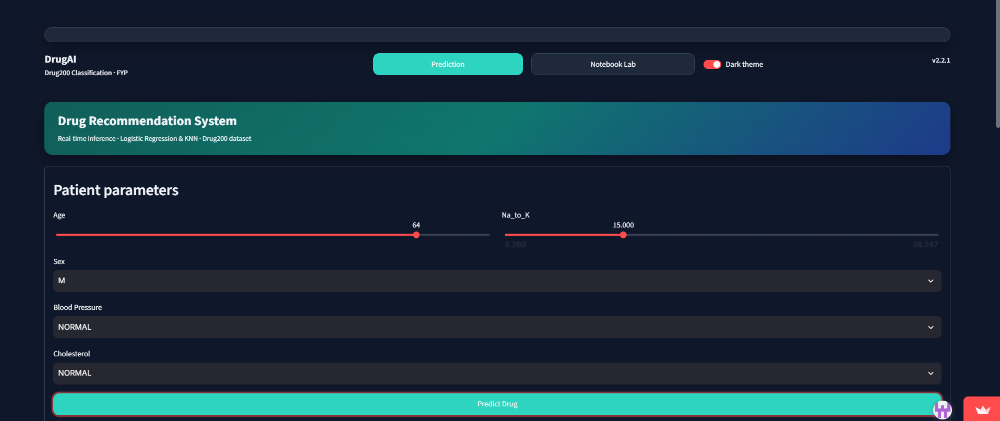
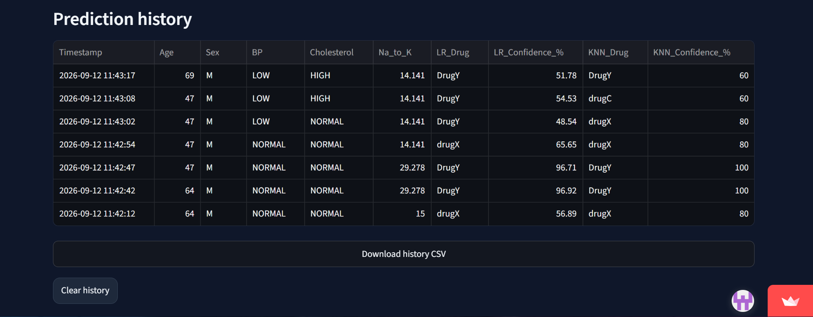
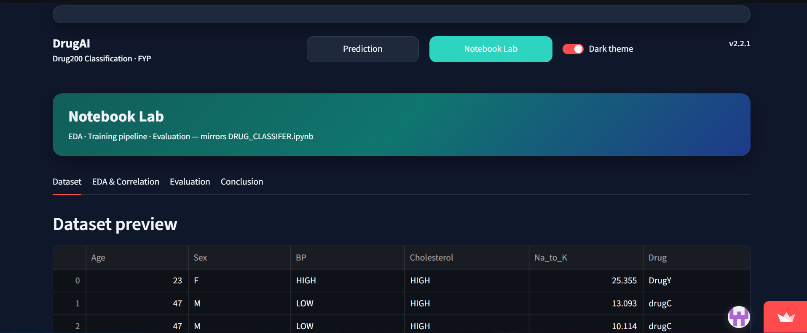
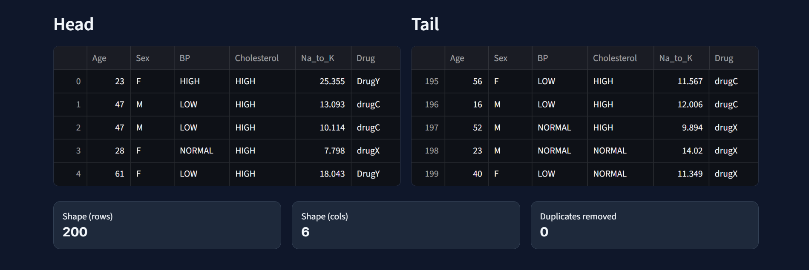
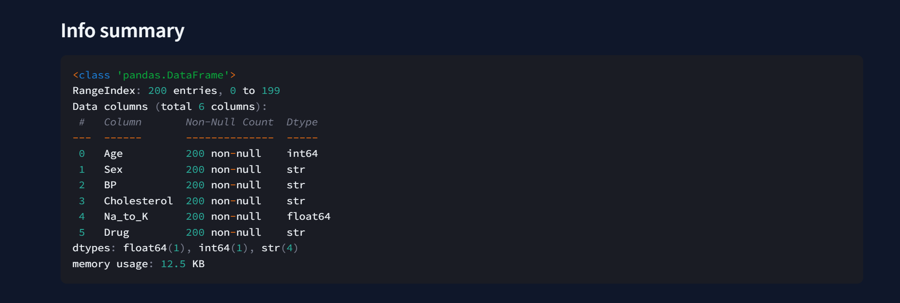
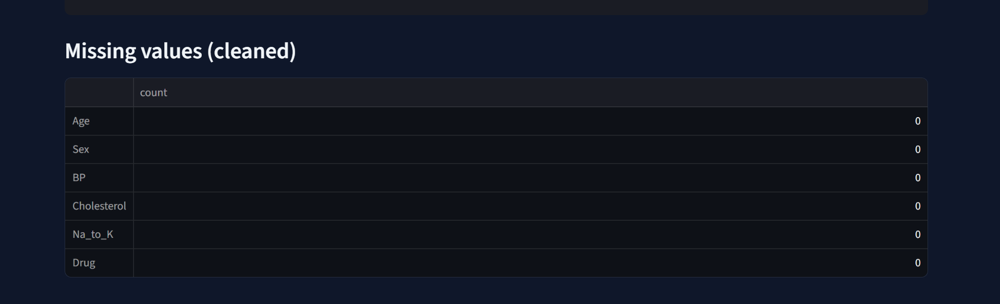
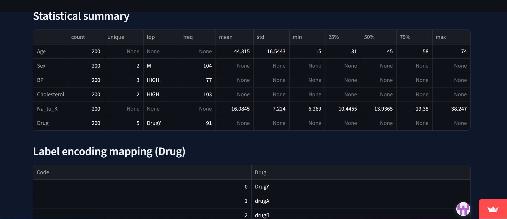

# 💊 DrugAI - Drug Recommendation System & Data Lab

An interactive Machine Learning web application and Exploratory Data Analysis (EDA) laboratory built with **Streamlit** and **Python**. The system classifies and predicts target drug types based on patient parameters (Age, Sex, Blood Pressure, Cholesterol, and Sodium-to-Potassium ratio) using multiple trained algorithms (Logistic Regression & KNN).

* **Live Interactive Demo:** [drug-classifier-final.streamlit.app](https://drug-classifier-final-fy63j8bqhmqdbfyfufn5of.streamlit.app/)
* **GitHub Repository:** [https://github.com/abdullahaieng/Drug-Classifier-Final](https://github.com/abdullahaieng/Drug-Classifier-Final/)

---

## 🌟 Key Features

- **Real-Time Inference Engine:** Predicts suitable drug prescriptions using Logistic Regression and K-Nearest Neighbors (KNN) algorithms.
- **Interactive Parameter Controls:** Adjust patient demographic metrics with real-time sliders and selection menus.
- **Prediction Probability Breakdown:** Visualizes confidence scores across all target classes.
- **In-App Prediction History:** Tracks user inputs with timestamped logs and instant CSV export capabilities.
- **Notebook Lab Environment:** Integrated Exploratory Data Analysis (EDA) module displaying dataset metrics, data hygiene checks, statistical distributions, and label encoding schemes.

---

## 📸 Screenshots & Workflow

Rename your uploaded images as `1.png` through `8.png` and place them inside an `assets/` directory in your repository.

### 1. Patient Parameters & Prediction Interface
Interactive input panel with custom sliders for Age and Na_to_K ratio alongside dropdown selections for Sex, Blood Pressure, and Cholesterol.



---

### 2. Prediction Probability Charts
Comparative visual output displaying class probability distributions for Logistic Regression versus KNN models.


---

### 3. Prediction History & CSV Export
Timestamped log of past inferences with options to download results as CSV or clear execution history.



---

### 4. Notebook Lab - Dataset Preview
Overview of the embedded EDA laboratory displaying raw dataset records and attribute tables.



---

### 5. Head/Tail Analysis & Dataset Shape
Dataset structure inspect tab showing sample head/tail rows, row/column counts, and duplicate record checks.



---

### 6. Dataset Info Summary
Data structural summary detailing column names, non-null entry counts, memory footprint, and data types (Dtype).



---

### 7. Missing Values Verification
Automated data cleaning tab confirming zero missing or null entries across all patient features.



---

### 8. Statistical Summary & Label Encoding
Comprehensive statistical summary table (mean, std, min/max quartiles) and categorical label encoding mappings for target classes.



---

## 🛠️ Tech Stack & Libraries

- **Framework:** [Streamlit](https://streamlit.io/)
- **Machine Learning:** Scikit-Learn (Logistic Regression, KNN)
- **Data Manipulation:** Pandas, NumPy
- **Visualizations:** Matplotlib, Seaborn
- **Language:** Python 3.x

---

## 🚀 Local Setup & Installation

1. **Clone the repository:**
   ```bash
   git clone [https://github.com/abdullahaieng/Drug-Classifier-Final.git](https://github.com/abdullahaieng/Drug-Classifier-Final.git)
